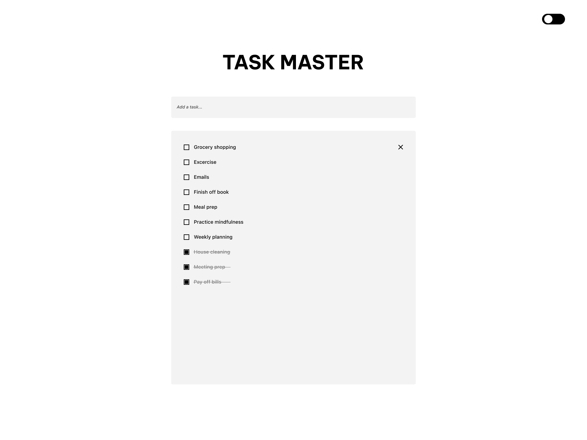
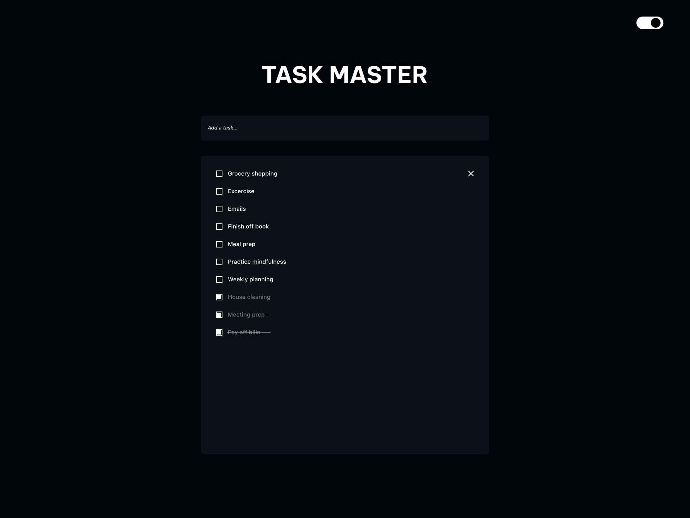

<div style = 'text-align: center; font-size: 1.5rem'>
<h1>TASK MASTER</h1>
</div>

## Description

<div style='text-align: justify;'>
Task Master is a web-based to-do list application allowing users to manage their daily tasks. With a minimalistic interface, users can add, complete, and remove tasks. The application supports features like task completion, task removal, and a dynamic interface that adjusts to the number of tasks.
</div>

<br/>

<!--Screenshots-->

<div style='text-align: center;'>

|||
|:-:|:-:|


</div>

## Built With 

<div style='text-align:left'>
* NEXT.js
<br/>
* React
<br />
* Local Storage
</div>


## Setup & Usage

#### Prerequisites
1. Node.js and npm: Install Node.js and npm, which are required for running the server and managing dependencies. Check your Node.js and npm version with:

```
node --version
npm --version
```

2. Git: Git is required to clone the repository.

#### Using the Application

1. Clone the repository
```
git clone https://github.com/ll0ngvu/Task-Master.git
```

2. Navigate to the Directory
```
cd Task-Master
```

3. Install Dependencies
```
npm install
```

4. Run the Application
```
npm run dev
```
* Access the app at http://localhost:3000 in your web browser.

<br/>

5. Application Features
* Add tasks using the input box and submit them by pressing Enter.
* Click on the checkbox to toggle a task's completion status.
* Remove tasks using the delete icon next to each task.

## License
Distributed under the MIT License.